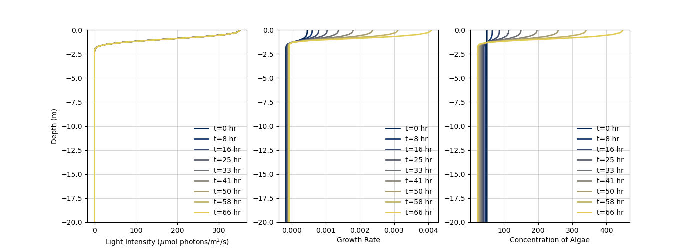
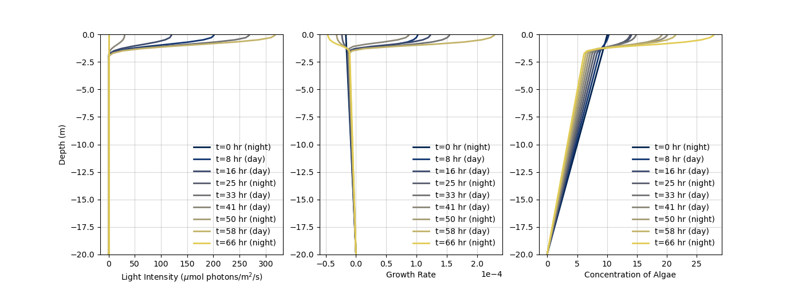
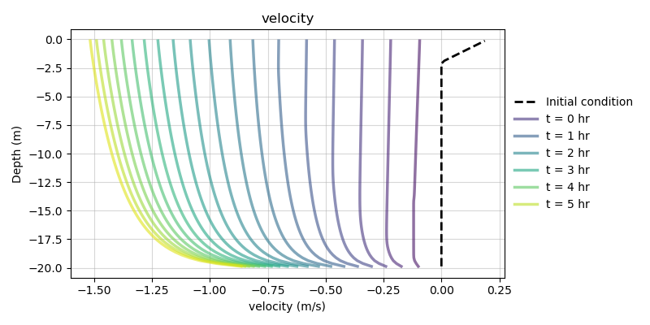
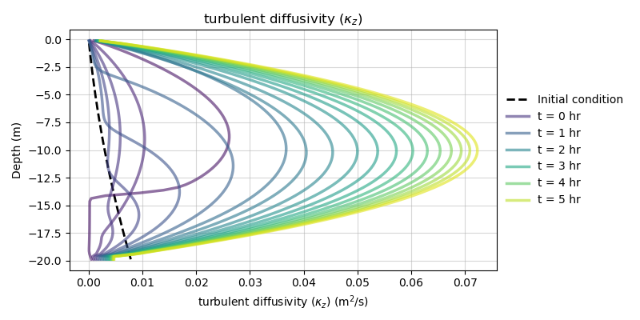
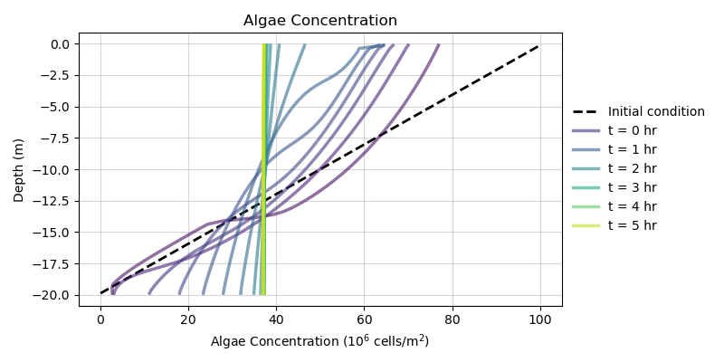

\tableofcontents

\section{Governing equations for flow}
We first discuss the derivation of the equations used for our one-dimensional water column model.  

\subsection{Reynolds-averaged Navier Stokes}
We start with the Reynolds-Averaged Navier Stokes, which reads:
\begin{equation}
\frac{\partial \overline{u_i}}{\partial t} 
+ \overline{u_j} \frac{\partial \overline{u_i} }{\partial x_j} 
= \frac{\partial }{\partial x_k} \overline{u_k u_i} 
- \frac{1}{\rho_0} \frac{\partial \overline{p}}{\partial x_i} 
- g \delta_{i3} + \nu \frac{\partial^2 }{\partial x_j \partial x_j}  \overline{u_i} 
\end{equation}
where flow is considered to be incompressible (solenoidal),
\begin{equation}
\frac{\partial u_i}{\partial x_i} = 0.
\end{equation}

<!-- The Boussinesq approximation is invoked to capture that density fluctuaions affect bouyancy but no other transport/state terms. These fluctuations are written $\beta \theta$ , where $\beta$ is the coefficient of thermal expansion.  -->
This equation in the $\hat{e_1}$ direction, expanded, reads
$$
\frac{\partial \overline{u}}{\partial t} 
+  \overline{u} \frac{\partial \overline{u} }{\partial x} 
+  \overline{v} \frac{\partial \overline{u} }{\partial y} 
+  \overline{w} \frac{\partial \overline{u} }{\partial z} 
= \frac{\partial }{\partial x} \overline{u' u'} 
+ \frac{\partial }{\partial y} \overline{v' u'} 
+ \frac{\partial }{\partial z} \overline{w' u'} 
- \frac{1}{\rho_0} \frac{\partial \overline{p}}{\partial x} 
+ \nu \left( \frac{\partial^2 u }{\partial x^2} + \frac{\partial^2 u }{\partial y^2 } +\frac{\partial^2 u }{\partial z^2 } \right).
$$
We neglect advection and gradients in the $x$ and $y$ directions and take $w=0$ (established by the boundary layer approxmiation), 
$$ 
\frac{\partial \overline{u}}{\partial t} 
+  \cancel{\overline{u} \frac{\partial \overline{u} }{\partial x} }
+  \cancel{\overline{v} \frac{\partial \overline{u} }{\partial y} }
+  \cancel{\overline{w} \frac{\partial \overline{u} }{\partial z} }
= \cancel{\frac{\partial }{\partial x} \overline{u' u'} }
+ \cancel{\frac{\partial }{\partial y} \overline{v' u'} }
+ \frac{\partial }{\partial z} \overline{w' u'} 
- \frac{1}{\rho_0}\frac{\partial \overline{p}}{\partial x} 
 + \nu \left(\cancel{\frac{\partial^2 u }{\partial x^2}} + \cancel{\frac{\partial^2 u }{\partial y^2 }} +\frac{\partial^2 u }{\partial z^2 } \right)
$$
We now have a simplified equation for Reynolds-averaged flow in the $\hat{e_1}$ direction. 
\begin{equation} \label{eq:simpl}
\frac{\partial \overline{u}}{\partial t} 
=  \frac{\partial }{\partial z} \overline{w' u'} 
- \frac{1}{\rho_0} \frac{\partial \overline{p}}{\partial x} 
 + \nu \frac{\partial^2 u }{\partial z^2 }.
\end{equation}
Next, we apply the Boussinesq assumption, which allows us to re-write the Reynolds Stress as a function of the mean velocity gradient. Note that the $k$ term drops out as our Reynolds stress is off-diagonal,
$$ \overline{w'u'}   =  \mu_t \left( \frac{\partial \overline{u} }{\partial z} + \frac{\partial \overline{w} }{\partial x} \right)  - \cancel{\frac{2}{3} k \delta_{13}}  = \mu_t \left( \frac{\partial \overline{u} }{\partial z} + \cancel{\frac{\partial \overline{w} }{\partial x}} \right) = \mu_t \frac{\partial \overline{u} }{\partial z}$$
We plug our expression for the Reynold's stress into Eq. \ref{eq:simpl},

$$ 
\frac{\partial \overline{u}}{\partial t} 
=  \frac{\partial }{\partial z} \left( \mu_t \frac{\partial \overline{u} }{\partial z} \right)
- \frac{1}{\rho_0} \frac{\partial \overline{p}}{\partial x} 
+ \nu \frac{\partial^2 \overline{u} }{\partial z^2 }
$$ 

$$ 
\frac{\partial \overline{u}}{\partial t} 
=  \mu_t \frac{\partial^2\overline{u} }{\partial z^2}
- \frac{1}{\rho_0} \frac{\partial \overline{p}}{\partial x} 
 + \nu \frac{\partial^2 \overline{u} }{\partial z^2 }
$$ 
We can group the turbulent and molecular viscosity terms,
$$ 
\frac{\partial \overline{u}}{\partial t} 
=   
- \frac{1}{\rho_0} \frac{\partial \overline{p}}{\partial x}  + 
 (\nu_t + \nu) \frac{\partial^2 \overline{u} }{\partial z^2 }
$$ 
however, since we assume that turbulent viscosity is far greater than molecular viscosity,
$$ \nu_t >> \nu $$
we often neglect molecular viscosity, leaving us with
$$ 
\frac{\partial \overline{u}}{\partial t} 
=   - \frac{1}{\rho_0} \frac{\partial \overline{p}}{\partial x} + 
 \nu_t  \frac{\partial^2 \overline{u} }{\partial z^2 }.
$$ 
After applying the Boussinesq assumption, we've escaped the need to resolve the Reynold's Stress, however, in discretizing this equation, we still need to approximate this turbulent viscosity $\nu_t$. Hence the need for a closure scheme.

\section{Turbulence closure}
Similarity theory tells us that $\nu_t$, which has units of [length$^2$ time$^{-1}$] can be scaled by a length scale times a velocity scale,
$$ \nu_t \approx \ell_T~ U_T  $$

Here I am using the subscript T to denote these quanitities being \textit{turbulent scales.} We estimate the velocity scale using the square root of the total turbulent kinetic energy,

$$ \text{TKE} = \text{tr}(\overline{u_i u_j}) = (\overline{u'^2} + \overline{v'^2} + \overline{w'^2}) $$ 
$$ q = \sqrt{\overline{u'^2} + \overline{v'^2} + \overline{w'^2}} $$ 

$$ \nu_t \approx \ell_T~ q  $$

Again, $\nu_t$ is a function $\nu_t(z,t)$ that dissipates energy from the mean velocity (due to subscale turbulence). 

\subsection{The TKE equation}
We can derive an equation for the turbulent kinetic energy, $q^2$. This process is fairly intensive so I will put it in an appendix or something. The equation for the turbulent kinetic energy $q^2$ given by, 
$$ \underbrace{\frac{\partial q^2}{\partial t}}_{1} =  \underbrace{\frac{\partial }{\partial z} (k_q  \frac{\partial q^2}{\partial z})}_{2} + \underbrace{2P}_{2} + \underbrace{2B}_{3} - \underbrace{2\epsilon}_{4} $$ 

Moving from left to right,
$$ [1]~~ \frac{\partial q^2}{\partial t}$$ 
is \textbf{unsteadiness}, or the change in turbulent kinetic energy over time;

$$ [2]~~ \frac{\partial }{\partial z} (k_q  \frac{\partial q^2}{\partial z})$$ 
is the \textbf{turbulent diffusion}, or a measure of how turbulent energy ``diffuses" throughout the fluid flow. This neither creates nor destroys turbulence-- just moves it. Next is 
$$ [3]~~ P =  \overline{u_iu_k}\frac{\partial u_i}{\partial x_k},$$ 
production, also called \textbf{shear production}. We expand this for our simplified scenario (neglecting gradients of $x$, $y$, $w=0$)
$$ P =  \overline{u'w'}\frac{\partial u}{\partial z} 
     +  \overline{v'w'}\frac{\partial v}{\partial z}
     +  \overline{w'w'}\cancel{\frac{\partial w}{\partial z}}$$ 

$$ P =  \mu_t \left( \frac{\partial \overline{u} }{\partial z} + \cancel{\frac{\partial \overline{w} }{\partial z}} \right) \frac{\partial u}{\partial z} 
+  \mu_t \left( \frac{\partial \overline{v} }{\partial z} + \cancel{\frac{\partial \overline{w} }{\partial y}} \right)\frac{\partial v}{\partial z}$$ 

$$ P =  \mu_t \left( \frac{\partial \overline{u} }{\partial z} \right)^2+  \mu_t \left( \frac{\partial \overline{v}}{\partial z} \right)^2$$ 


Dissipation is a disaster 
$$ [4]~~ \epsilon  = - \nu \left( \overline{\frac{\partial u_i}{\partial x_k}\frac{\partial u_i}{\partial x_k}} \right)$$ 
$$ \epsilon = - \nu \left(\overline{ \left(  \frac{\partial u}{\partial z}\right)^2} 
+ \overline{\left( \frac{\partial v}{\partial z} \right)^2 }
+ \overline{\left( \cancel{\frac{\partial w}{\partial z}} \right)^2} \right) $$

$$ 
\frac{\partial q^2}{\partial t} =  \frac{\partial }{\partial z} (k_q  \frac{\partial q^2}{\partial z}) + \nu_t \frac{\partial u}{dz}^2 + 2 \frac{g}{\rho_0} \kappa_p \frac{\partial p}{\partial z} - 2 \frac{(q^2)^{3/2}}{B_1 l} $$ 
Similar to our simplications before, we can comfortably neglect advection of TKE as long as the time scale of dissipation is shorter than the advection time scale $T_a$ over one grid cell in the horizontal. 

$$ \frac{\partial q^2}{\partial t} =  \frac{\partial }{\partial z} (k_q  \frac{\partial q^2}{\partial z}) - \overline{u_iu_k}\frac{\partial u_i}{\partial x_k} + 2B - \nu \overline{\frac{\partial u_i}{\partial x_k}\frac{\partial u_i}{\partial x_k}} $$ 


\subsection{Boundary layer approximation for environmental flow}
The equations used in our model assume that in our environment, the lateral length scales $L_x$ and $L_y$ are far greater than the vertical length scale (or depth) $L_z$. This means that gradients in the $x$ and $y$ directions can be seen as very small, or negligble. We maintain gradients in the pressure direction as these drive the flow and are assumed not to be functions of $x.$

$$\frac{\partial u}{\partial t} + u \cancel{\frac{\partial u}{\partial x}} + v \cancel{\frac{\partial u}{\partial y}}  + w \frac{\partial z}{\partial x} = - \frac{1}{\rho} \frac{\partial p}{\partial x} + \nu_t \left( \cancel{\frac{\partial^2 u}{\partial x^2}} + \cancel{\frac{\partial^2 u}{\partial y^2}} + \frac{\partial^2 u}{\partial z^2} \right)$$

$$\frac{\partial u}{\partial t}  + w \frac{\partial z}{\partial x} = - \frac{1}{\rho} \frac{\partial p}{\partial x} + \nu_t \left( \frac{\partial^2 u}{\partial z^2} \right)$$ 

We also can prove that $w=0$, simplifying our equation to 
\begin{equation} \frac{\partial u}{\partial t}  = - \frac{1}{\rho} \frac{\partial p}{\partial x} + \nu_t \left( \frac{\partial^2 u}{\partial z^2} \right)
\end{equation}


\subsection{Boussinesq gradient diffusion hypothesis}
Boussinesq attempted to simplify the mess of the Reynold's stress tensor $\overline{u_i u_j}$ by reasoning that these correlation terms would act like a stress tensor in a flow. 

In deriving the Navier-Stokes we define a stress tensor as 


$$ -(\tau_{ij} + P \delta_{ij}) = -2 \mu S_{ij}   = -  \mu \left( \frac{\partial U_i }{\partial x_j} + \frac{\partial U_j }{\partial x_i}) \right)  $$  
where $\tau_{ij}$ represents shear stresses and $P \delta_{ij}$, or pressure, acts as a body force along the diagonal of the tensor. 

If the Reynold's stresses are like shear stresses imposed on flow, we can subsitute them in here 
$$ - (\overline{u_i u_j} + \frac{2}{3} k \delta_{ij})  = - \mu_t \left( \frac{\partial \overline{u_i} }{\partial x_j} + \frac{\partial \overline{u_j} }{\partial x_i} \right)  $$
only this turbulent stress tensor would be approximated by some turbulent viscosity $\mu_t$ and the  
$$ \overline{u_i u_j}   =  \mu_t \left( \frac{\partial \overline{u_i} }{\partial x_j} + \frac{\partial \overline{u_j} }{\partial x_i} \right)  - \frac{2}{3} k \delta_{ij} $$
Note that the trace of the RHS would be 
$$ \mu_t( 2 \frac{\partial u_i}{\partial x_i} - \frac{2}{3}k)  =  \mu_T ( - 3 \frac{2}{3} k ) = - 2 \mu_T k  = - 2 \mu_T(\frac{1}{2} \overline{u_i'u_i'})$$ 
The main thing to note here is that using this approxmiation, we can now represent the Reynold's stress as being driven by gradients in the mean flow. This will help us from a closure perspective. 

\subsection{The two-equation model}
Our equation for the turbulent kinetic energy $q$ is now given by, 
$$ \frac{\partial q^2}{\partial t} =  \frac{\partial }{\partial z} (k_q  \frac{\partial q^2}{\partial z}) + 2P + 2B - 2\epsilon $$ 

$$ \frac{\partial q^2}{\partial t} =  \frac{\partial }{\partial z} (k_q  \frac{\partial q^2}{\partial z}) - \overline{u_iu_k}\frac{\partial u_i}{\partial x_k} + 2B - \nu \frac{\partial u_i}{\partial x_k} \frac{\partial u_i}{\partial x_k} $$ 

$$ 
\frac{\partial q^2}{\partial t} =  \frac{\partial }{\partial z} (k_q  \frac{\partial q^2}{\partial z}) + \nu_t \frac{\partial u}{dz}^2 + 2 \frac{g}{\rho_0} \kappa_p \frac{\partial p}{\partial z} - 2 \frac{(q^2)^{3/2}}{B_1 l} $$ 
We can neglect advection as long as the time scale of dissipation ir short than the advection time scale $T_a$ over one grid cell in the horizontal. 


\section{The Mellor-Yamada 2.5 closure}
The chosen closure scheme for our 1-D turbulent model is the Mellor-Yamada 2.5 scheme. This scheme approximates the eddy viscosity as 
\begin{equation}
\nu_t = S_m  q  L  
\end{equation}
and the turbulent diffusivity as  
\begin{equation}
\kappa_q = S_h  Q  L,   
\end{equation}
where $S_m$ and $S_h$ are empircally-derived stability functions, $q$ is the turbulent kinetic energy, and $l$ is our turbulent length scale. 

\begin{equation}
\frac{\partial q^2}{\partial t} = \frac{\partial}{\partial z} \left(q l S_q \frac{\partial q^2}{\partial z} \right) + 2 \left(P_s + P_b - \frac{q^3}{B_1l} \right)
\end{equation}

\begin{equation}
\frac{\partial q^2 l}{\partial t} = \frac{\partial}{\partial z} \left(q l S_q \frac{\partial q^2 l}{\partial z} \right) + l E_1 (P_s + P_b) - \frac{q^3}{B_1l} W(z)
\end{equation}

where $P_s$ denotes shear production, and is given by
$$ P_s = \nu_T \left( \left(\frac{\partial U}{\partial z}\right)^2 + \left(\frac{\partial V}{\partial z} \right)^2 \right),
$$
the buoyancy production, $P_b$, is calculated as
$$ P_b = -\kappa_t \frac{g}{\rho_0} \frac{\partial \overline{\rho}}{\partial z},$$ 
and finally the turbulent dissipation is given by 
$$ \epsilon = \frac{q^3}{B_1 l}. $$
The function $W(z)$ is a wall-proximity function that adjusts dissipation as $z$ approaches a boundary. $S_q$ and $E_1$ are both empirical constants. 


\section{Discretization}

\subsection{Advection-Diffusion Equation for Algae}

Our governing equation for algae is given by,
\begin{equation} \label{eq:1}
\frac{\partial C}{\partial t} + w_s \frac{\partial C}{\partial z}= \frac{\partial }{\partial z} \left( \kappa_t \frac{\partial C}{\partial z} \right) + \gamma C 
\end{equation}

where $C$ is the concentration of algae (scalar), $\gamma$ is some source/loss term, and $w_s$ is the sinking or swimming speed of the algae: $w_s$  can be positive (\textit{Microcystis}) or negative (phytoplankton). 

We break down the discretization of Equation \ref{eq:1} by the left hand (time derivative + advection) and right hand (diffusion) sides. The right-hand side is trickiest. 

\subsubsection{Discretizing diffusion}
We first evaluate the diffusion term in space (neglecting $\gamma$ for now). Note here that diffusion is given by $\kappa_t$, which respresents turbulent diffusion (a quantity we will solve for in the turbulence closure). Because the subscripts get messy, I'll drop the subscript $t$, but all diffusion in this equation refers to $\kappa_t$. 

We evaluate $\kappa_t \frac{\partial C}{\partial z}$ at $i+1/2$, $i- 1/2$,
$$ 
 \frac{\partial }{\partial z} \left( \kappa_t \frac{\partial C}{\partial z} \right) \rightarrow \frac{1}{\Delta z} \left( \left(\kappa_t \frac{\partial C}{\partial z}\right)_{i + 1/2}  - \left(\kappa_t \frac{\partial C}{\partial z}\right)_{i - 1/2} \right)
$$ 
but evaluate C at $i+1$, $i-1$ (this is where I will now drop the subscript on $\kappa_t$),
$$ 
=  \frac{1}{\Delta z} \left( \kappa_{i + 1/2} \frac{\partial C}{\partial z}_{i + 1}  - \kappa_{i - 1/2} \frac{\partial C}{\partial z}_{i - 1} \right).
$$


{height=200}

We represent these $1/2$ stencil points for $\kappa_t$ as the average of the two neighboring cells,
 $$ \kappa_{ i + 1/2}  \approx  \frac{ \kappa_{i + 1} +  \kappa_{i} }{2} $$
 $$ \kappa_{ i - 1/2}  \approx  \frac{ \kappa_{i - 1} +  \kappa_{i} }{2} $$

And discretize the graident of $C$, 
$$ \left(\frac{\partial C}{\partial z}\right)_{i + 1/2} \approx \frac{ C_{i+1} - C_{i}}{\Delta z} $$ 

$$ \left(\frac{\partial C}{\partial z}\right)_{i - 1/2} \approx \frac{ C_{i} - C_{i-1}}{\Delta z} $$ 
Putting these together, 
$$ 
\frac{1}{\Delta z} \left( \left(\kappa \frac{\partial C}{\partial z}\right)_{i + 1/2}  - \left(\kappa \frac{\partial C}{\partial z}\right)_{i - 1/2} \right) \rightarrow  \frac{1}{\Delta z} \left(\frac{ \kappa_{i+1} +  \kappa_{i} }{2} \frac{ C_{i+1} - C_{i}}{\Delta z} -   \frac{\kappa_{t (i - 1)} +  \kappa_{i}}{2} \frac{ C_{i} - C_{i-1}}{\Delta z} \right) $$ 

$$ 
= \frac{1}{2 \Delta z^2} \left(  (\kappa_{i +1} +  \kappa_{i})( C_{i+1} - C_{i}) -   (\kappa_{i - 1} +  \kappa_{i})( C_{i} - C_{i-1}) \right) $$ 
Factor according to $C$,

\begin{equation} \begin{split}  \label{eq:laplacian}
= C_{i+1} \left( \frac{1}{2 \Delta z^2}  \left(\kappa_{i +1} +  \kappa_{i} \right)  \right) \\  + 
 C_{i} \left( \frac{1}{2 \Delta z^2}  \left(-\kappa_{i +1} - 2\kappa_{i} - \kappa_{i-1} \right)  \right) \\
+ C_{i-1} \left( \frac{1}{2 \Delta z^2}  \left(-\kappa_{i -1} -  \kappa_{i} \right)  \right)  \end{split} \end{equation}


\subsubsection{Discretizing in time}

Next we discretize  
$$ 
\frac{\partial C}{\partial t} + w_s \frac{\partial C}{\partial z}= \frac{\partial }{\partial z} \left( \kappa_t \frac{\partial C}{\partial z} \right) + \gamma C
$$ 
in time. We use an implicit scheme, 
$$ \frac{C_i^{n+1} - C_i^n}{\Delta t} + w_s \frac{C_i^{n+1} - C_{i-1}^{n+1}}{\Delta z}  = \left( \kappa_t \frac{\partial C}{\partial z} \right)^{n+1} + \gamma C_i^{n+1}  $$ 

We plug in our expression for the Laplacian discretized in space (Eq. \ref{eq:laplacian}), evaluated at time $n+1$,

$$\begin{split} \frac{C_i^{n+1} - C_i^n}{\Delta t} + w_s \frac{C_i^{n+1} - C_{i-1}^{n+1}}{\Delta z} = C_{i+1}^{n+1} \left( \frac{1}{2 \Delta z^2}  \left(\kappa_{i +1}^{n} +  \kappa_{i} \right)  \right) \\  + 
 C_{i}^{n+1} \left( \frac{1}{2 \Delta z^2}  \left(-\kappa_{i +1}^{n} - 2\kappa_{i}^{n} - \kappa_{i-1}^{n} \right)  \right) \\
+ C_{i-1}^{n+1} \left( \frac{1}{2 \Delta z^2}  \left(-\kappa_{i -1}^{n} -  \kappa_{i}^{n} \right)  \right) \\ + \gamma C_i^{n+1}  \end{split} $$

$$ \begin{split} C_i^{n+1} - C_i^n +  \Delta t w_s \frac{C_i^{n+1} - C_{i-1}^{n+1}}{\Delta z} = C_{i+1}^{n+1} \left( \frac{\Delta t}{2 \Delta z^2}  \left(\kappa_{i +1}^{n} +  \kappa_{i}^{n} \right)  \right) \\  + 
 C_{i}^{n+1} \left( \frac{\Delta t}{2 \Delta z^2}  \left(-\kappa_{i +1}^{n} - 2\kappa_{i}^{n} - \kappa_{i-1}^{n} \right)  \right) \\
+ C_{i-1}^{n+1} \left( \frac{\Delta t}{2 \Delta z^2}  \left(-\kappa_{i -1}^{n} -  \kappa_{i}^{n} \right)  \right)  \\ + \Delta t \gamma C_i^{n+1} 
  \end{split} $$


This all simplifies out to, 
$$ \begin{split}  C_i^n  =  C_{i+1}^{n+1} \left( -\frac{\Delta t}{2 \Delta z^2} (\kappa_{i}^{n} + \kappa_{i+1}^{n+1}) \right) \\
+  C_{i}^{n+1} \left(1 + \gamma_i^n + \frac{\Delta t w_s}{\Delta z} +  \frac{\Delta t}{2 \Delta z^2}(\kappa_{i +1}^{n} + 2\kappa_{i}^{n} + \kappa_{i-1}^{n})- \Delta t \gamma \right) \\ 
+ C_{i-1}^{n+1} \left( - \frac{\Delta t w_s}{\Delta z} -  \frac{\Delta t}{2 \Delta z^2} (\kappa_{i -1}^{n} +  \kappa_{i}^{n} ) \right) \end{split} $$

In code, to solve this tridiagonal system, we initialize three vectors A, B, and C to represent the diagonals of the matrix. 

{height=300}


```{python}{eval|false}
 # Initialize empty arrays for tridiagonals of algae matox 
    aA, bA, cA, dA = lib.initialize_abcd(N)

     beta = dt / dz**2 
 # Set up vectors (a --> i+1 ; b --> main diagonal, i ; c --> i-1)
    ws    = diatoms.ws
    dtdz  = dt/dz
    gamma = diatoms.get_loss_and_growth(I_in = 350, current_concentration = Ap) # Growth + loss term

    aA[1:top]  = - beta/2 * (Kzp[0:top-1]+ Kzp[1:top]) 
    bA[1:top]  =  1 + ws*dtdz  + beta/2 *(Kzp[2:top+1] + \
      2*Kzp[1:top] + Kzp[0:top-1]) - gamma[1:top]*dt 
    cA[1:top] = -ws*dtdz  - beta/2 * (Kzp[1:top] + Kzp[2:top+1])
    dA = Ap # RHS, C_n 
```

We now need to consider the boundary conditions. Because we are considering a scalar value, we want zero flux at the bed and at the top. 

$$  \frac{C_{N} - C_{N+1}}{\Delta z } = 0 $$ 
$$  C_{N}  = C_{N+1}$$ 
and by the same logic, 
$$  C_{0}  = C{-1}$$ 

\subsubsection{Zero-flux at top of water column}
Setting these terms equal in the equation,
$$ \begin{split}  C_{N}^n  =  C_{N}^{n+1} \left( -\frac{\Delta t}{2 \Delta z^2} (\kappa_{i}^{n} + \kappa_{i+1}^{n+1}) \right) \\
+  C_{N}^{n+1} \left(1 + \gamma_i^n + \frac{\Delta t w_s}{\Delta z} +  \frac{\Delta t}{2 \Delta z^2}(\kappa_{i +1}^{n} + 2\kappa_{i}^{n} + \kappa_{i-1}^{n}) - \Delta t \gamma \right) \\ 
+ C_{N-1}^{n+1} \left( - \frac{\Delta t w_s}{\Delta z} -  \frac{\Delta t}{2 \Delta z^2} (\kappa_{i -1}^{n} +  \kappa_{i}^{n} ) \right) \end{split} $$
we see that several terms cancel, 
$$ \begin{split}  C_{N}^n  =  
 C_{N}^{n+1} \left(1 + \gamma_i^n + \frac{\Delta t w_s}{\Delta z} +  \frac{\Delta t}{2 \Delta z^2}(\kappa_{i}^{n} + \kappa_{i-1}^{n}) - \Delta t \gamma \right) \\ 
+ C_{N-1}^{n+1} \left( - \frac{\Delta t w_s}{\Delta z} -  \frac{\Delta t}{2 \Delta z^2} (\kappa_{i -1}^{n} +  \kappa_{i}^{n} ) \right) \end{split} $$

In code, we impose this like so, 
```{python}{eval|false}
    aA[top] = -ws*dtdz - beta/2 * (Kzp[top] + Kzp[top-1])
    bA[top] = 1 + ws*dtdz  + beta/2 * (Kzp[top] + Kzp[top-1]) - gamma[top]*dt
    dA[top] = Ap[top]
``` 
\subsubsection{Zero-flux at bed of water column}
Now setting terms equal at $i=0$, the bed, 

$$ \begin{split}  C_0^n  =  C_{1}^{n+1} \left( -\frac{\Delta t}{2 \Delta z^2} (\kappa_{i}^{n} + \kappa_{i+1}^{n+1}) \right) \\
+  C_{0}^{n+1} \left(1 + \gamma_i^n + \frac{\Delta t w_s}{\Delta z} +  \frac{\Delta t}{2 \Delta z^2}(\kappa_{i +1}^{n} + 2\kappa_{i}^{n} + \kappa_{i-1}^{n})- \Delta t \gamma \right) \\ 
+ C_{0}^{n+1} \left( - \frac{\Delta t w_s}{\Delta z} -  \frac{\Delta t}{2 \Delta z^2} (\kappa_{i -1}^{n} +  \kappa_{i}^{n} ) \right) \end{split} $$

$$ \begin{split}  C_0^n  =  C_{1}^{n+1} \left( -\frac{\Delta t}{2 \Delta z^2} (\kappa_{i}^{n} + \kappa_{i+1}^{n+1}) \right) 
+  C_{0}^{n+1} \left(1 + \gamma_i^n + \frac{\Delta t}{2 \Delta z^2}(\kappa_{i +1}^{n} + \kappa_{i}^{n})- \Delta t \gamma \right) \end{split} $$


In code, we impose this like so, 
```{python}{eval|false}
    bA[0] = 1  + beta/2 * (Kzp[1] + Kzp[0]) -  gamma[0]*dt # + ws*dtdz 
    cA[0] = -beta/2 * (Kzp[1] + Kzp[0])
    dA[0] =  Ap[0]
``` 


\section{Phytoplankton Growth}
Now that we have an equation for advection-diffusion of phytoplankton, we can dig into the growth and loss terms. Here, I'll follow the conventions set forth in Huisman's paper. 

They discretize the light dependence of phytoplankton growth using a Monod function,
$$ p(I) = p_{max} \frac{I}{H + I}$$ 
$H$ is the half-saturation constant of light limited growth and $p_{max}$ is the maximum specific production rate for the species. Physically, this means that growth at any given point in the water column is the max-possible growth scaled by a proportion of the amount of available light $I$ and the species' sensitivity to light availability $H$. 

The light available at any point in the water column is a function of the amount of algae above it (self-shading) and background turbidity. They express this using Lambert-Beer's law applied to nonuniform population density distributions:
\begin{equation}
I(z,t) = I_{in} \exp \left( - \int_0^z \left( \sum_{j=1}^n k_j \omega_j (\sigma, t) \right) d\sigma - K_{bg} z \right) 
\end{equation}
where $I_{in}$ is incident light intensity at the top of the water column, $k_j$ is the specific light attenuation coefficient of the phytoplankton species $j$; $K_{bg}$ is the background turbitiy (eg, not phytoplankton) and $\sigma$ is an integration variable.

In code, we calculate that with the following function, 
```{python}{eval|false}
def self_shading(ListofAlgae, I_in, turbidity):
    ''' Use Lambert-Beer's Law to calculate light intensity at each depth '''
    corrected_z = (-1) * z # We want water depth [cm] to be zero 
    # at the top, 20 at the bottom (positive numbers)
    kxC = np.zeros(N)
    for species in ListofAlgae:
        kxC += species.k * species.c

    I = np.zeros(N)
    vector = kxC - (turbidity*corrected_z)
    for i in (range(N)):
        I[i] = np.sum(vector[i:-1]) * z[i]

    I[I<0] = 1e-10
    I = I_in * np.exp(-I)   
```
we can calculate the photic depth with, 

```{python}{eval|false}
# Get first element where light is less than 90% of I_in 
photic_depth =  z[I<(0.9 * I_in)][-1] 
```

Some examples of what algal growth looks like, using common parameters sourced from the Huisman paper, are shown below. In these examples there's no fluid motion at all (or particle sinking)-- just looking purely at growth rate as a function of light. With constant light, we see that algal growth increases monotonically -- within three days the population has increased over four-fold. Note that below the photic zone, however, algal are dying (albeit much more slowly). Thus, the net change in \textit{total algal population} is determined by the \textit{ratio of the photic zone} to the rest of the water column (assuming algae are dispersed uniformly). While growth may expload at the surface, if the rest of the algae are steadily dying, the net population could decline. 

{height=250}

We can also impose a more-realistic light field which varies as a function of time (e.g., the diurnal light cycle.) Now, the algae are only exposed to light for 12 hours a day. They resulting figure shows a far more variable algal mass. If we sum the concentration over the water column, we see that mass is declining.  

{height=250}

{height=200}

\newpage

<!-- We can write the population for phytoplankton $C$ as
\begin{equation}
\frac{\partial C}{\partial t} + w_s \frac{\partial C}{\partial z}  = \kappa \frac{\partial^2 C}{\partial z^2} + \Gamma(z)C 
\end{equation}

where $\Gamma(z)$ is the source + sink term (e.g., mortality + growth). 
$$ \Gamma(z) =  p_i(I) - L_i$$ 
and $I(z,t)$ is the light intensity at depth $z$ and time $t$.
Thus, we expect $\Gamma$ to vary as a function of depth and time. -->


\section{Combining growth with advection-diffusion}

{height=250}

{height=250}

{height=250}


\newpage

\subsection{Turbulent kinetic energy equation}
$$ 
\frac{\partial q^2}{\partial t} =  \frac{\partial }{\partial z} (k_q  \frac{\partial q^2}{\partial z}) + 2P + 2B - 2\epsilon $$ 


$$ 
\frac{\partial q^2}{\partial t} =  \frac{\partial }{\partial z} (k_q  \frac{\partial q^2}{\partial z}) + \nu_t \frac{\partial u}{\partial z}^2 + 2 \frac{g}{\rho_0} \kappa_p \frac{\partial p}{\partial z} - 2 \frac{(q^2)^{3/2}}{B_1 l} $$ 

$$ 
\frac{\partial q^2}{\partial t} =  \frac{\partial }{\partial z} (k_q  \frac{\partial q^2}{\partial z}) + \underbrace{\nu_t \left(\frac{\partial u}{\partial z}\right)^2}_{\text{shear production}} + \underbrace{2 \frac{g}{\rho_0} \kappa_p \frac{\partial p}{\partial z}}_{\text{bouyancy production}} - \underbrace{2 \frac{(q^2)^{3/2}}{B_1 l}}_{\text{dissipation}} $$ 

We will think of barotropic pressure is $f(t)$ and barolinic is $f(t,z)$. We will write this gradient $\frac{\partial p}{\partial x}$ as $P_x$, the pressure gradient in the x-direction. We can now think about discretizing this equation,

$$ 
\frac{\partial q^2}{\partial t} =  \underbrace{\frac{\partial }{\partial z} (k_q  \frac{\partial q^2}{\partial z})}_{n+1} + \underbrace{\nu_t \left(\frac{\partial u}{\partial z}\right)^2}_{n} + \underbrace{2 \frac{g}{\rho_0} \kappa_p \frac{\partial p}{\partial z}}_{n} - \underbrace{2 \frac{(q^2)^{3/2}}{B_1 l}}_{\text{mixed}} $$
Start to discretize...($Q=q^2$)
$$ \frac{Q_i^{n+1} - Q_i^{n}}{\Delta t} =  
\frac{1 }{\Delta z} \left( k_q  \frac{Q_i^{n+1} - Q_{i-1}^{n+1}}{\Delta z} \right) 
+ (\nu_t)_i^{n} \left( \left( \frac{\partial u}{\partial z}\right)_i^n \right)^2 
+ 2 \frac{g}{\rho_0} (\kappa_p)_i^n \frac{\partial p}{\partial z} - 2 \frac{(q^2)^{3/2}}{B_1 l} $$ 

We write the dissipation as a mixed discretization,
$$ - 2 \left(\frac{\sqrt{Q}}{B_1 l} \right)^n_i \cdot Q_i^{n+1}$$ 
where it's partially linearized and partially explicit.

<!-- END  -->

We start with the continuity equation,
\begin{equation}
\frac{\partial \rho}{\partial t} + \frac{\partial }{\partial x_i} (\rho U_i) = 0 
\end{equation}


where flow is considered to be divergent-free, or solenoidal.

Meanwhile, the Reynolds-Averaged Navier Stokes reads:
\begin{equation}
\frac{\partial \overline{U}}{\partial t} 
+ \overline{U_j} \frac{\partial \overline{U_k} }{\partial x_j} 
+ \rho \epsilon_{jkl} f_k U_l 
= \frac{\partial }{\partial x_k} \overline{u_k u_j} 
- \frac{\partial \overline{P}}{\partial x_j} 
- g \hat{e_3} 
\end{equation}

The Boussinesq approximation is invoked to represent that density fluctuaions affect bouyancy but no other transport/state terms. These fluctuations are written $\beta \theta$ , where $\beta$ is the coefficient of thermal expansion. 


Mellor and Herring (1973) uses the following equation:
\begin{equation}
\langle \frac{p}{\rho} (\frac{\partial u_i}{\partial x_j} + \frac{\partial u_j}{\partial x_i})  \rangle = - \frac{q}{3l_1} ( \overline{u_iu_j} - \frac{\delta_{ij}}{3} q^2) + C_1 q^2 (\frac{\partial U_i}{\partial x_j} + \frac{\partial U_j}{\partial x_i})  
\end{equation} 


We are establishing equations for the following: $\overline{u_k u_i u_j},~ \overline{p u_j},~ \overline{u_i u_j \theta},$ and $\overline{p\theta}$ 

Math Note
The velocity gradient $\frac{\partial U_j}{\partial x_i}$ can be decomposed into symmetric and antisymmetric parths,
$$\frac{\partial U_j}{\partial x_i} = S_{ij} + \Omega_{ij} $$ 
where the symmetric rate-of-strain tensor is
$$ S_{ij} = \frac{1}{2} \left( \frac{\partial U_i}{\partial x_j} + \frac{\partial U_j}{\partial x_i} \right) $$  
and the asymmetric part is, 
$$ \Omega_{ij} = \frac{1}{2} \left( \frac{\partial U_i}{\partial x_j} - \frac{\partial U_j}{\partial x_i} \right) $$  

\subsection{Parameterization}
\begin{equation}
\langle u_k u_i u_j \rangle = \frac{3}{5} 
 ~l q S_q 
 \left( \frac{\partial \langle u_i u_j \rangle}{\partial x_k}  
+ \frac{\partial \langle u_i u_k \rangle}{\partial x_j}
+ \frac{\partial \langle u_j u_k \rangle}{\partial x_i} \right)
\end{equation}

In this equation $S_q$ is a dimensionless number. 

Sm :
\begin{equation}
\frac{A_1}{A_2} \frac{B_1(\gamma - C_1) - (B_1 (\gamma_1 - C_1) + 6 (A_1 + 3A_2)) R_f}{B_1 \gamma_1 - (B_1(\gamma_1 + \gamma_2) - 3A_1) R_f}
\end{equation}

where $$ \gamma_1 = \frac{1}{3} - \frac{2 A_1}{B_1} $$ 
and
$$ \gamma_2 = \frac{B_2}{B_1} - \frac{6 A_1}{B_1} $$ 

$$ $$ 

Sh:
$$ S_h  =  \frac{A_2 (1 - \frac{6 A_1}{B_1})}{1-(3 A_2 B_2 G_h + 18 A_1 A_2 G_h) }  = \frac{A_2 (1 - \frac{6 A_1}{B_1})}{(1-3 A_2 G_h (B_2+6 A_1))}   $$
 

 $$ 
S_m = \frac{A_1 (1 - 3C_1 - \frac{6A_1}{B_1}) + S_H G_h(18A_1 + 9A_1A_2)}{(1 - 9A_1 A_2 G_h)}
 $$ 

Richardson's number:
$$ G_H = - \frac{L^2}{Q^2}\frac{g}{\rho_0}\frac{\partial}{\partial z}$$ 


\subsection{Chosen parameters}
$$ C_1 = \gamma_1 - \frac{1}{3A_1} B_1^{1/3} \approx 0.08$$ 

$$ B_2 = \frac{B_1^{1/3}}{P_{rt}} \frac{u_T^2 \langle \theta^2 \rangle}{H^2} \approx $$ 
$$ B_1 = 16.6  $$ 

\section{writing equations based on code}

$$ bX = bX - \frac{aX cX}{bX}$$ 

$$ dX = dX - \frac{aX dX}{bX}$$ 

$$ u_* = U_{bed} \sqrt{C_d}$$ 

$$G_h = - \left(\frac{N_{BV} * L}{Q + Small} \right)^2$$

$$ diss= 2 \frac{dt * \sqrt{Q^2}}{B_1 L_p} $$ 

